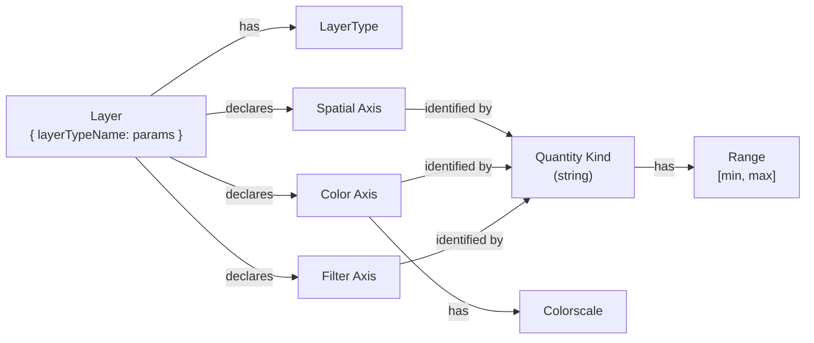

# Gladly API Documentation

## Overview

Gladly is a GPU-accelerated multi-axis plotting library that uses WebGL (via [regl](https://github.com/regl-project/regl)) for high-performance data rendering and [D3.js](https://d3js.org/) for interactive axes and zoom controls.

The library features a **declarative API** where you register layer types once and then create plots by specifying data and layer configurations.

---

## Data Model

Understanding the core data model makes all other concepts fall into place.



### Axes

All axes — spatial, color, and filter — share two concepts:

- A **quantity kind**: a string that identifies what the axis measures. Layers that use the same quantity kind on the same axis position automatically share that axis and its range.
- A **range** [min, max]: the interval of values displayed or filtered on that axis.

A plot has up to four **spatial axes** (`xaxis_bottom`, `xaxis_top`, `yaxis_left`, `yaxis_right`). For spatial axes the quantity kind is any string; it determines the axis label and, for the special value `"log10"`, switches to a logarithmic scale.

In addition to spatial axes, each layer can declare:

- **Color axes** — map a per-point numeric value to a color via a colorscale. Layers sharing the same quantity kind share a common range and colorscale.
- **Filter axes** — discard points outside a range. Bounds are independently optional (open interval): `{ min: 10 }` discards values below 10 with no upper limit.

All axes can have their ranges overridden in `config.axes`.

### Colorscale

A **colorscale** maps a normalized value in [0, 1] to an RGBA color. Every color axis has a colorscale, referenced by name (e.g. `"viridis"`, `"plasma"`). The layer type sets a default; it can be overridden per quantity kind in `config.axes`.

All standard matplotlib colorscales are available without any setup. Custom colorscales can be registered with `registerColorscale()`. See the [colorscales reference](api/LayerTypes.md#colorscales).

### LayerType

A **LayerType** defines a visualization strategy. It specifies:

- Spatial axis **quantity kinds** (`x`, `y`) — for compatibility checking between layers sharing an axis
- Color axis **quantity kinds** — named slots (e.g. slot `"v"`) mapping to a shared color axis
- Filter axis **quantity kinds** — named slots (e.g. slot `"z"`) mapping to a shared filter axis
- **GLSL vertex and fragment shaders**
- A **JSON Schema** describing its configuration parameters
- A **`createLayer` factory** that extracts data arrays and returns a layer config object

### Layers in Config

Each entry in `config.layers` is a JSON object `{ layerTypeName: parameters }`. The plot creates a rendered layer for each entry by calling the layer type's `createLayer` factory with those parameters and the current data object.

A layer's parameters typically include:
- **Data references** — property names in the `data` object (e.g. `xData: "x"`)
- **Axis assignments** — which spatial axes to use (`xAxis`, `yAxis`)

See [Configuring Plots](api/PlotConfiguration.md) for the full config format.

### Data Format

All data values must be `Float32Array` for direct GPU memory mapping:

```javascript
// Correct
const data = {
  x: new Float32Array([1, 2, 3]),
  y: new Float32Array([4, 5, 6]),
  v: new Float32Array([0.1, 0.5, 0.9])
}

// Incorrect — will throw
const bad = { x: [1, 2, 3], y: [4, 5, 6] }
```

### Config Structure

```javascript
plot.update({
  data: { /* named Float32Arrays */ },
  config: {
    layers: [
      // Each entry: { layerTypeName: { ...parameters } }
      { scatter: { xData: "x", yData: "y", vData: "v" } }
    ],
    axes: {
      // Spatial axes — omit for auto-calculated range
      xaxis_bottom: { min: 0, max: 100 },
      yaxis_left:   { min: 0, max: 50 },
      // Color axes — key is the quantity kind
      temperature: { min: 20, max: 80, colorscale: "plasma" },
      // Filter axes — both bounds optional (open interval)
      depth: { min: 10, max: 500 }
    }
  }
})
```

---

## Sub-topics

- **[Quick Start](Quickstart.md)** — installation and minimal working example
- **[Configuring Plots](api/PlotConfiguration.md)** — `plot.update()`, axes config, auto-range, multi-layer, interaction, examples
- **[Colorbars and Filterbars](api/ColorbarsAndFilterbars.md)** — floating color/filter widgets, auto-creation via config, manual placement
- **[Writing Layer Types](api/LayerTypes.md)** — `LayerType` constructor, shaders, color axes, filter axes, GLSL helpers, constants
- **[Built-in Layer Types](api/BuiltInLayerTypes.md)** — `scatter`, `colorbar`, `filterbar` layer type reference
- **[API Reference](api/Reference.md)** — `Plot`, `registerLayerType`, `getLayerType` and other public API entries
