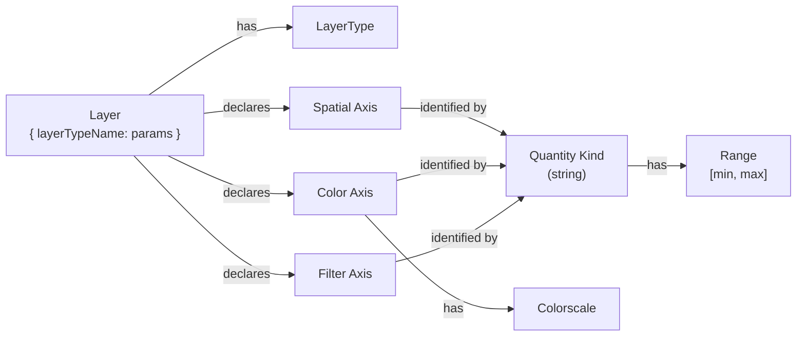

# Gladly Concepts

This page provides a conceptual overview of Gladly's data model and core concepts. Understanding these makes all other documentation easier to follow.

---

## Overview

Gladly is a GPU-accelerated multi-axis plotting library that uses WebGL (via [regl](https://github.com/regl-project/regl)) for high-performance data rendering and [D3.js](https://d3js.org/) for interactive axes and zoom controls.

The library features a **declarative API** where you register layer types once and then create plots by specifying data and layer configurations.

---

## Data Model



---

## Axes

All axes — spatial, color, and filter — share two concepts:

- A **quantity kind**: a string that identifies what the axis measures. Layers that use the same quantity kind on the same axis position automatically share that axis and its range.
- A **range** `[min, max]`: the interval of values displayed or filtered on that axis.

### Spatial Axes

A plot has up to four **spatial axes** (`xaxis_bottom`, `xaxis_top`, `yaxis_left`, `yaxis_right`). For spatial axes the quantity kind is any string; it determines the axis label and, for the special value `"log10"`, switches to a logarithmic scale.

### Color Axes

In addition to spatial axes, each layer can declare **color axes** — map a per-point numeric value to a color via a colorscale. Layers sharing the same quantity kind share a common range and colorscale.

### Filter Axes

**Filter axes** discard points outside a range. Bounds are independently optional (open interval):

```javascript
{ min: 10 }        // discards values below 10, no upper limit
{ max: 500 }       // discards values above 500, no lower limit
{ min: 10, max: 500 }  // closed interval
```

All axes can have their ranges overridden in `config.axes`.

---

## Colorscale

A **colorscale** maps a normalized value in [0, 1] to an RGBA color. Every color axis has a colorscale, referenced by name (e.g. `"viridis"`, `"plasma"`). The layer type sets a default; it can be overridden per quantity kind in `config.axes`.

All standard matplotlib colorscales are available without any setup. Custom colorscales can be registered with `registerColorscale()`. See the [Colorscales](../configuration/Colorscales.md) reference.

---

## LayerType

A **LayerType** defines a visualization strategy. It specifies:

- Spatial axis **quantity kinds** (`x`, `y`) — for compatibility checking between layers sharing an axis
- Color axis **quantity kinds** — named slots (e.g. slot `''`) mapping to a shared color axis
- Filter axis **quantity kinds** — named slots mapping to a shared filter axis
- **GLSL vertex and fragment shaders**
- A **JSON Schema** describing its configuration parameters
- A **`createLayer` factory** that extracts data arrays and returns a layer config object

---

## Layers in Config

Each entry in `config.layers` is a JSON object `{ layerTypeName: parameters }`. The plot creates a rendered layer for each entry by calling the layer type's `createLayer` factory with those parameters and the current data object.

A layer's parameters typically include:
- **Data references** — property names in the `data` object (e.g. `xData: "x"`)
- **Axis assignments** — which spatial axes to use (`xAxis`, `yAxis`)

See [Configuring Plots](../configuration/PlotConfiguration.md) for the full config format.

---

## Data Format

All data in Gladly is represented as a **tree of `DataGroup` nodes with `Data` leaves**, where every column in a `Data` leaf is a `ColumnData` instance.

When you call `plot.update({ data, config })`, the framework automatically converts the plain `data` object into this tree via `normalizeData()`:

- A flat object whose values are `Float32Array` columns (`{ x, y, v }`) is wrapped as `Data` and placed under the key `"input"` in an enclosing `DataGroup`.
- A nested object whose values are themselves flat datasets or sub-groups (`{ survey1: { x, y }, survey2: { x, y } }`) is converted directly to a `DataGroup`, with each child recursively wrapped.
- An object that already implements the `DataGroup`/`Data` interface (has `columns()` and `getData()`) is used unchanged.

After normalisation, columns in a `Data` leaf are always accessed as `ColumnData` instances via `getData()`. Column names in a `DataGroup` use **dot notation** (`"survey1.x"`, `"input.y"`, etc.).

The normalised `DataGroup` is what `createLayer` receives as its `data` argument. Layer types call `Data.wrap(data)` on it (a no-op when already normalised) and then use `d.getData(colName)` to retrieve columns as `ColumnData`.

Each value in the `attributes` map returned from `createLayer` must be one of:

- A **`Float32Array`** — uploaded directly as a GPU vertex buffer.
- A **column name string** — resolved at draw time via `getData()` on the current `DataGroup`; the resulting `ColumnData` is uploaded as a GPU texture and sampled in the vertex shader.
- A **`ColumnData`** instance — used directly; uploaded as a GPU texture.
- A **computed attribute expression** — a single-key object `{ computationName: params }` that the framework resolves to a `ColumnData` (GPU texture or GLSL expression) at draw-command build time.

```javascript
// Flat data — normalised to DataGroup { input: Data { x, y, v } }
// Columns accessible as 'input.x', 'input.y', 'input.v' via getData()
plot.update({
  data: {
    x: new Float32Array([1, 2, 3]),
    y: new Float32Array([4, 5, 6]),
    v: new Float32Array([0.1, 0.5, 0.9])
  },
  config: { layers: [{ points: { xData: 'input.x', yData: 'input.y', vData: 'input.v' } }] }
})

// Nested data — normalised to DataGroup { survey1: Data, survey2: Data }
// Columns accessible as 'survey1.x', 'survey2.x', etc.
plot.update({
  data: {
    survey1: { x: new Float32Array([...]), y: new Float32Array([...]) },
    survey2: { x: new Float32Array([...]), y: new Float32Array([...]) }
  },
  config: { layers: [{ points: { xData: 'survey1.x', yData: 'survey1.y' } }] }
})

// Attribute values — column name string, ColumnData, or computed expression
attributes: {
  x: 'survey1.x',                              // column name → resolved to ColumnData at draw time
  count: { histogram: { input: 'input.v', bins: 50 } }  // computed expression
}
```

See [Computations](../configuration/Computations.md) for the full expression syntax and built-in computations.

---

## Config Structure

```javascript
plot.update({
  data: { /* named Float32Arrays */ },
  config: {
    layers: [
      // Each entry: { layerTypeName: { ...parameters } }
      { points: { xData: "x", yData: "y", vData: "v" } }
    ],
    axes: {
      // Spatial axes — omit for auto-calculated range
      xaxis_bottom: { min: 0, max: 100 },
      yaxis_left:   { min: 0, max: 50 },
      // Color axes — key is the quantity kind
      temperature: { min: 20, max: 80, colorscale: "plasma" },
      // Filter axes — both bounds optional (open interval)
      depth: { min: 10, max: 500 }
    }
  }
})
```

---

## Next Steps

- **[Quick Start](../Quickstart.md)** — installation and minimal working example
- **[Configuring Plots](../configuration/PlotConfiguration.md)** — plot.update(), axes config, auto-range, multi-layer, interaction
- **[Built-in Layer Types](../configuration/BuiltInLayerTypes.md)** — points, lines, bars, histogram, tile, colorbar, filterbar
- **[Computations](../configuration/Computations.md)** — transforms and computed attributes
- **[PlotGroup](../user-api/PlotGroup.md)** — coordinating multiple plots with shared data and auto-linking
- **[Writing Layer Types](../extension-api/LayerTypes.md)** — custom layer types with shaders, color axes, filter axes
